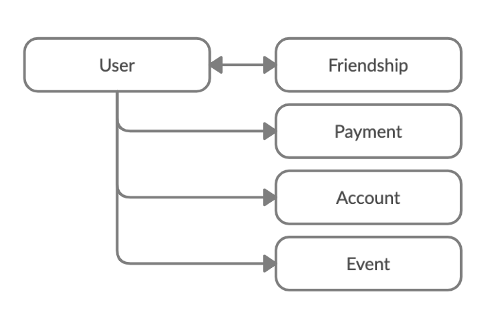
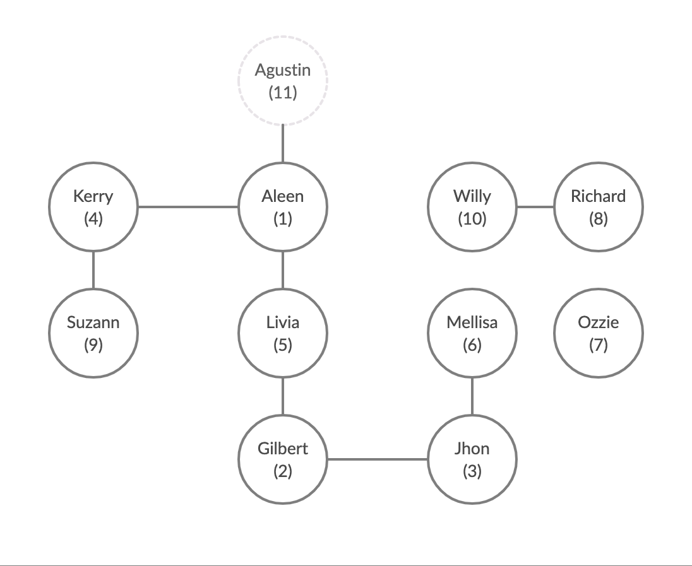

# **Venmo** - Social Payment Service

This solution was made to support the transactions between friends along the Venmo platform.

The source code is located at [GitHub](https://github.com/afmicc/venmo_api) and it is running in Heroku, the base URL: https://agustin-venmo-api.herokuapp.com.

## Database Design

The database design is represented in the following diagram:


### Friendships

Onc of the most relevant decisions, in terms of how to represent a relationship, was the friendship between users. There are several options around it, I choose one that allows the users have bidirectionla relationship without replicating data.

Having that in mind, I create a model to represent the relation between user which I call Friendship. That model has two fields: `user` and `friend`. `user` is who creates the relationship between them and `friend` is the other one. Despite who is each one, the meaning is the same, they are connected.

To guaranty that there is not more than one record that reflects the friendship, I create a model validation at Friendship model, which is in charge of checking if it doesn't exist another record with the same people involved.

Also, in the User model, I have to add two `has_many` association to manage the case that the user could be at any side of the relationship, as a user or a friend. Then I define the `friends` associations through `friendships`. Finally, I create a `friends` method to access to user's friends in a direct way.

### Payments

Payments are the heart of the system. They are in charge of tracking the money exchanges through Venmo. The model has references to the users who send and receive the payment.

For a consistency reason, I replicate the users' email in the payment model because if it is requested that a user must be deleted from the platform, the payments registry should keep consistency along the time.


### Account

An account is responsible to know how much money a user has on the platform. The relation between users and account is single, so, the users add a `has_one` association to their model. Since the account existence is mandatory for each user, it's created by a callback to ensure the create action is run as soon as the user was created. So, the user is responsible for creates their own account.

At the moment, the account table only saves the `balance` information. That information could be stored in the user model too. But, saving it in a different table allows to keep the user payment information split from basic user ones since other kinds of data are required for purchases, ie. credit card number.

### Event

The event table stores the exchange events between users. The information required to create an event is only the user involved and a message. So, it could be extended to store any other system events in the future.


## Available endpoints

The different available endpoints follow the REST conventions. To allow versioning and segregation between API and a frontend, all the endpoints start with the prefix `/api/v1/`. That means, if at some point in the product life is required to make a disruptive change between the previous version and the new one, for example, the structure of the response, we could change the URL prefix and we are still supporting the un-updated clients.

In the same direction, the folder structure of the solution reflects the endpoint paths. This makes it easier to find where an endpoint was coded.

### Users

#### `POST /api/v1/users`

This action allows creating a new user. This endpoint was not required but it allows us to complete the completed user flow.

**Request body**:
```json
{
    "user":
    {
        "name": "Agustin",
        "email": "agustin.martinez@rootstrap.com"
    }
}
```

#### `GET /api/v1/users/:user_id`

Get the user's information. This endpoint was not required but it allows us to check which user we are trying to access.

**Response body**:
```json
{
    "user": {
        "id": 11,
        "email": "agustin.martinez@rootstrap.com",
        "name": "Agustin"
    }
}
```

#### `GET /api/v1/users/:user_id/feed?page=1`

The purpose of this endpoint is to see the user activity, even their friends and friends of them.

The steps followed to get the different user level activities were:

1. Get all the user friend's id and the user's id
1. Get all the `Friendships` filtering by the previous ids combination. As a result, I obtain all the relationships between the user and their friends. To contribute to this feature I create the scope `friendships_of` at the `Friendships` model.
1. Then, I just retain the `user_id` and `friend_id` from the `Friendship` table. As a result, I obtain the ids of the users between the current user and the friendships located at the second level. That I called `contacts`. That information is returned by the User method: `contacts_for_feed`.
1. Finally, I query the `Event` table by the contact's id.

How the activity list could be too large, the answer is limited to 10 activities per request. To achieve it I use the [pagy gem](https://github.com/ddnexus/pagy) which gives the functionality out of the box. The information about the paginator is also included in the response body.

**Response body**:
```json
{
    "events": [
        {
            "content": "Agustin paid Aleen on 09 Oct 21:07 - This is a test",
            "created_at": "2020-10-09T21:07:17.251Z"
        },
        ...
    ],
    "pagy": {
        "count": 15,
        "page": 1,
        "items": 10,
        "pages": 2
    }
}
```

#### `GET /api/v1/users/:user_id/balance`

Get the user's balance information.

**Response body**:
```json
{
    "balance": 900.0
}
```

### Friendships

#### `POST /api/v1/users/:user_id/friendships?friend_id=1`

This action allow creating a new friendship between two already created users.

The field `friend_id` is mandatory and it has to refer to an existent user.

This endpoint was not required but it allows us to establish relationships between users quickly.

### Payments

#### ` POST /api/v1/users/:user_id/payments`

This action allow sending a payment to a user on the platform.

**Request body**:

```json
{
    "payment":
    {
        "amount": 50,
        "friend_id": 11,
        "description": "This is a test"
    }
}
```

As you can see at the `PaymentsController#create`, there is a single call to the service `PaymentCreationService`. The aim of that service is to encapsulate the process of creating a payment. It checks that all the information is right, creates the payment record, and interacts with other services to complete the entire creation process.

One of the services that take part in the payment creation process is `EventRegisterService`. This service is responsible for registering the event and as I mentioned before it could be extended to register any system events as the `Event` model.

The last one is `AccountManagerService` which is in charge of any operations related to users' money. Also, it encapsulates other operations, like request many to external providers, to give other services only one interface to interact. For example, when the `PaymentCreationService` is creating a payment, it calls the `AccountManagerService` to increase or decrease the money but it doesn't care from where the money cames.

In addition, the `MoneyTransferService` service is the suggested mock service to emulate the calls to an external money provider that it is invoked at `AccountManagerService`.

## Other comments

### Code analyzers

I add some code analyzers and tools to improve the development process and follow the language best practices that I daily use in my projects. It is the case of `brakeman`, `annotate`, `reek`, `rubocop`, `rails_best_practices` and others.

Before I push the changes to the repository, I run the following commands to ensure that everything is right.

```bash
    $ bundle exec brakeman . -z -q
    $ bundle exec rubocop .
    $ bundle exec reek app lib public spec tmp
    $ bundle exec rails_best_practices .
    $ bundle exec rspec
    $ bundle exec open coverage/index.html
```


### Test Unit strategy

I choose an exhaustive approach to write the tests over trying to encapsulate test cases inner shared examples or other techniques. Why? Because this approach allows me to follow the test contexts and behaviours in a fast way. If a test fails, it will be easier to track the test steps, just scrolling down, instead of scroll around the same file or different files.

A similar decision I take around the error messages which are defined in the translation files. So, I replicate the string at the test, it prevents some change in text content without takes in an account which other features will be affected.


## Seed data

The project contains a file with some example data. Also, it is the same located in the Heroku database of the solution.

The following diagram reflects which are the users and their relationships:


As you can see the node `Agustin (11)`, is the node that will be created if you run the [Postman collection](doc/Venmo_API.postman_collection.json) with preloaded data attached.
